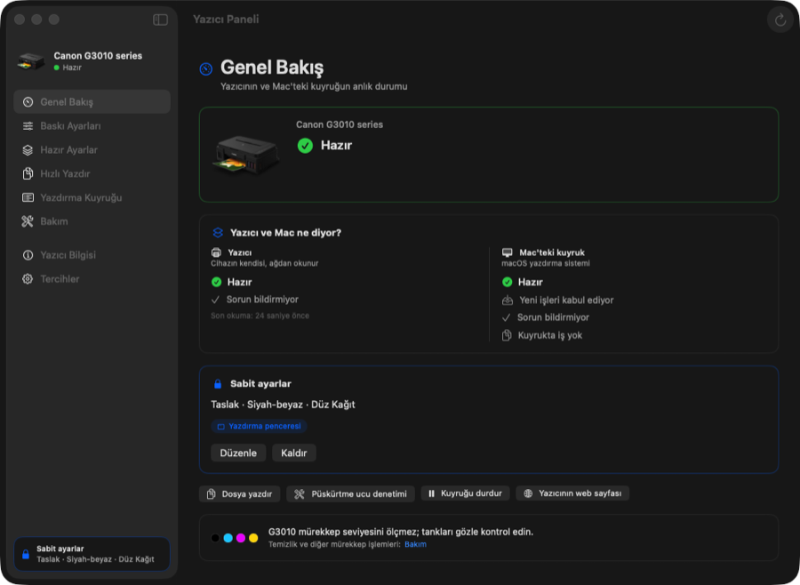
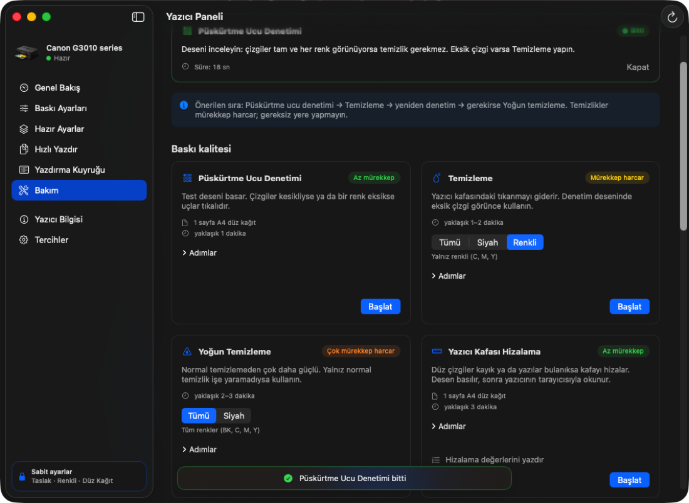

# Canon Printer Panel for Mac (Canon PIXMA G3010)

*Yazıcı Paneli* — a free, open-source (MIT) Canon printer utility for macOS.

🇹🇷 [Türkçe](README.tr.md)

**A native macOS control panel for the Canon PIXMA G3010 (Canon G series ink tank printer).** It shows the printer's real status, locks print settings for every app (e.g. "always print in draft"), and runs maintenance (head cleaning, nozzle check, print head alignment…) from your Mac.

On the G3010, Canon's own Mac tools (Canon IJ Printer Utility) send maintenance commands that the printer silently ignores. This app talks to the printer in its own protocol (IVEC/CHMP), so **Canon head cleaning, nozzle check and the other maintenance functions actually work on a Mac.**



> Not affiliated with Canon; this is not an official Canon product. Tested only with the **Canon G3010**.
> The interface is currently in **Turkish**.

## Features

- **Overview:** The printer's own status and the Mac print queue side by side. Uses Canon's own error texts (e.g. "Out of paper… press RESUME"). If the queue gets stuck, it resumes it in one click, without asking for a password.
- **Lock print settings (e.g. always draft):** Quality, grayscale, paper type, paper size, brightness and halftoning can each be locked. Locking works on three layers:
  1. The printer's default settings (used by Chrome, `lp` and "Default Settings")
  2. "Last Used Settings" of the macOS print dialog
  3. **Strict mode:** every job is held for a moment, the locked settings are written into it, then it is released. No app can override them.

  Unlocking restores everything to how it was.
- **Presets:** Draft · Grayscale, Draft · Color, Extra draft, Standard, Photo paper. You can also save your own.
- **Quick Print:** Drag and drop files. Options for copies, page range, orientation, fit to page and pages per sheet. Includes a manual duplex wizard (the G3010 has no automatic duplex).
- **Queue:** Cancel, hold, resume and reprint jobs.
- **Maintenance:**
  - Nozzle check
  - Cleaning (all / black / color), deep cleaning, system cleaning
  - Paper feed roller and bottom plate cleaning
  - Print head alignment, print alignment values
  - Reset ink counter

  While an operation runs, the printer's live status is shown and it can be canceled with **Stop**.

  
- **Device settings:** Auto power on (USB only), auto power off timer, quiet mode (scheduled), remaining ink notification.
- **Menu bar:** Shows the printer status. From here you can lock a preset, unlock settings, resume a stuck queue or cancel the current job.
- **Chrome extension:** Chrome's own print dialog sends its own color and resolution values and overrides the locked settings. The extension adds a **"Canon G3010 · Sabit ayarlar"** (locked settings) destination to the print dialog; jobs printed there always use the locked settings.

## Requirements

- macOS 26 (Tahoe) or later. The prebuilt release is for Apple Silicon (arm64).
- Canon's macOS printer driver must be installed, and the printer must be added under **System Settings › Printers & Scanners**.
- For maintenance and printer status, the printer and the Mac must be on the same network.

## Installation

### A) Prebuilt release (recommended)

1. Download `Yazici-Paneli-….zip` from the [Releases](../../releases) page and double-click to unzip it.
2. Drag **Yazıcı Paneli.app** into your **Applications** folder.
3. The app is not notarized by Apple, so macOS refuses to open it the first time:
   - Go to **System Settings › Privacy & Security** and click **Open Anyway** next to the "Yazıcı Paneli was blocked" message.
   - Or run this in Terminal:
     ```bash
     xattr -dr com.apple.quarantine "/Applications/Yazıcı Paneli.app"
     ```
4. If macOS asks for permission to connect to devices on your local network, click **Allow**. It is needed for printer status and maintenance.

### B) Build from source

Xcode is not required; the Command Line Tools are enough:

```bash
xcode-select --install
git clone https://github.com/Boceque/canon-printer-panel-macos.git
cd canon-printer-panel-macos
./derle.sh
```

`derle.sh` does the following, in order:
1. Builds the app.
2. Creates the `.app` bundle and signs it locally.
3. Installs it into `/Applications`.
4. Installs the Chrome bridge.

To only build into the project folder without installing, use `./derle.sh --kurma`.

### Chrome extension (optional)

On first launch the app installs the Chrome bridge itself and copies the extension files to `~/Library/Application Support/Yazıcı Paneli/Chrome Eklentisi`. Then:

1. Type `chrome://extensions` into Chrome's address bar.
2. Turn on **Developer mode** in the top right.
3. Click **Load unpacked**. In the file dialog press ⇧⌘G, paste this path, press Return and click **Select**:
   ```
   ~/Library/Application Support/Yazıcı Paneli/Chrome Eklentisi
   ```
4. Pin the extension to the toolbar from the puzzle-piece icon.
5. When printing, choose **Canon G3010 · Sabit ayarlar** as the destination. Chrome remembers this choice.

After updating the app, press the extension's ↻ (reload) button in `chrome://extensions`.

Besides Chrome, Chrome Beta/Canary, Chromium, Brave and Edge are supported.

## How it works (technical notes)

- **Queue and settings:** Uses `libcups` (IPP) and `lpadmin`. On macOS admin accounts, changing printer defaults and resuming the queue do not require a password.
- **Quality:** Canon's "Draft" setting means `CNIJPrintQuality=15` at 300 dpi in the driver. Draft quality on photo paper causes a printer error, so quality is left alone for photo paper.
- **Maintenance:** Commands are sent directly to the printer, in the format used by Canon's Linux driver:
  - Maintenance jobs: an IVEC XML job to port 9100 (`StartJob › SetJobConfiguration › Cleaning/TestPrint/RollerCleaning › EndJob`).
  - Status, cancel (`CancelJob`) and ink counter reset (`VendorCmd ResetCounter`): the CHMP channel on port 80.
- **Diagnostics:** Print the status without opening the UI:
  ```bash
  "/Applications/Yazıcı Paneli.app/Contents/MacOS/YaziciPaneli" --tani            # queue, jobs, PPD, locked settings
  "/Applications/Yazıcı Paneli.app/Contents/MacOS/YaziciPaneli" --tani --cihaz    # the printer's own status and settings
  "/Applications/Yazıcı Paneli.app/Contents/MacOS/YaziciPaneli" --tani --gunluk   # latest log lines
  ```

## Uninstall

1. If settings are locked, click **Kaldır** (unlock) in the app. Printer and print dialog settings are restored; if strict mode is on, its background helper is stopped too.
2. Move **Yazıcı Paneli.app** to the Trash.
3. Optionally also delete:
   - `~/Library/Application Support/Yazıcı Paneli` (settings and log)
   - the extension in Chrome
   - `~/Library/Application Support/Google/Chrome/NativeMessagingHosts/com.caglar.yazicipaneli.json`

## Known limitations

- The G3010 does not measure ink levels; check the tanks visually.
- Auto power on only works over a USB cable, not over Wi‑Fi.
- For deep cleaning and system cleaning, it was verified that the printer accepts the command; they were not run to completion to avoid wasting ink.
- Even when a cleaning is canceled, some ink may be used until the printer stops (a few seconds).
- The app is not signed with an Apple Developer ID (see Installation › step 3).

## License

[MIT](LICENSE) — free to use, modify and share. Provided as is, without warranty: maintenance operations use ink, use them at your own risk.
